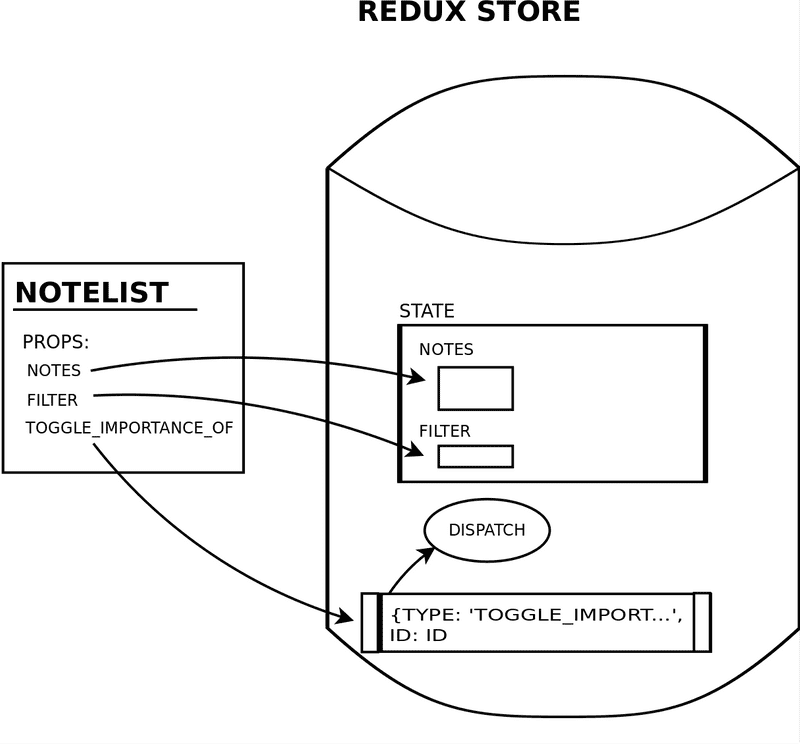

# **Part 6**
This part focuses on the Redux library which manages the state of React applications. We will use it to move the Application's state & State Logic outside React components. This is advisable when applications grow larger and larger

## **Flux-architecture and Redux**
So far: 
* State and State handler methods are placed in the Root componenet of the application
* State and its handler methods passed to other componenets with props

Next:
* Use Redux library to move the state logic & state itself OUTSIDE of React components

### **Flux-architecture**
Flux architecture makes state management easier

State is placed into its own **stores**
State in the store is NOT changed directly, but rather with different **actions**

### **Redux**
Redux works with the same principle as Flux architecture, but is a bit simpler (even Facebook uses Redux)

#### **[Redux Overview](https://redux.js.org/tutorials/fundamentals/part-1-overview)**
* Store is the center of every Redux application and is a container that holds the global state
* JS Object with a few special functions and abilities
  * Never directly modify or change the state that is kept inside the Redux store
  * To update --> Create a plain **action** object and **dispatch** it to the store to tell it what happened
    * When an action is dispatched, the store runs the root **reducer** function which creates the new state based on the old state and action
  * Finally, the store notifies **subscribers** of the updated state so that the View can be updated

**Main idea behind Redux**: A single centralized place to contain the global state in your application and specific patterns to follow when updating the state to make the code predictable

#### **Actions**
```js
const addTodoAction = {
  // Unique descriptive name to use in Reducer function
  // Usually "feature/specific event"
  type: 'todos/todoAdded',
  // additional fields can be added depending on action
  payload: 'Buy milk'
}
```

#### **Reducers**
```javascript
const initialState = { value: 0 }

function counterReducer(state = initialState, action) {
  // Check to see if the reducer cares about this action
  if (action.type === 'counter/incremented') {
    // If so, make a copy of `state`
    return {
      ...state,
      // and update the copy with the new value
      value: state.value + 1
    }
  }
  // otherwise return the existing state unchanged
  return state
}
```

Similar to an **event listener** but is conditional based on the action type passed to it

Must follow:
* New state is a result of the *state* and *action* arguments
* Never directly modify/change state
* NO asynchronous logic, randomness, or other "side effects"
  * Must be deterministic

#### **Store**
```javascript
import { configureStore } from '@reduxjs/toolkit'

// Reducer passed
const store = configureStore({ reducer: counterReducer })
// Store method that returns current state value
console.log(store.getState())
// {value: 0}
```

#### **Dispatch**
```javascript
// Store method to update the state with an action object
// ONLY WAY TO UPDATE THE STATE
store.dispatch({ type: 'counter/incremented' })

console.log(store.getState())
// {value: 1}
```

The **event trigger** in the application

### **Back to FSO**
Customary to use **switch** commands rather than **if** statements
```javascript
const counterReducer = (state = 0, action) => {
  switch (action.type) {
    case 'INCREMENT':
      return state + 1
    case 'DECREMENT':
      return state - 1
    case 'ZERO':
      return 0
    default: // if none of the above matches, code comes here
      return state
  }
}
```

Reducers are never supposed to be called directly, but instead as a parameter to the ```createStore``` function
```javascript
import { createStore } from 'redux'

const counterReducer = (state = 0, action) => {
  // ...
}

const store = createStore(counterReducer)
```

Now the store uses the reducer to handle actions  
Actions are ```dispatched``` to the store with
```javascript
store.dispatch({type: 'INCREMENT'})
```

When the state is changed, a ```subscribe``` method is used to create callback functions that the store calls
```js
store.subscribe(() => {
  const storeNow = store.getState()
  console.log(storeNow)
})
```

### **Pure functions, immutable**
Testing will be done with the ```deep-freeze``` library which ensures that the reducer has been correctly defined as an **immutable** function
```javascript
npm install --save-dev deep-freeze
```

Ensures that the reducer does not change the state of the store given to it
```deepFreeze(state)```


### **Uncontrolled forms**
An uncontrolled form is one where its fields are NOT bound to the state of the App component
* CANNOT generate dynamic error messages
* CANNOT disable the submit button based on input

An method handler can access the content of a field with a **name** attribute
```javascript
addNote = (event) => {
  const content = event.target.note.value
}

...

<form onSubmit={...}>
  <input name="note" />
  <button type="submit">add</button>
</form>
```

### **Action Creators**
**React components do not need to know Redux action types and forms**  
--> So we can use ```action creators``` which are functions that create actions
```javascript
const createNote = (content) => {
  return {
    type: 'NEW_NOTE',
    data: {
      content,
      important: false,
      id: generateId()
    }
  }
}

const toggleImportanceOf = (id) => {
  return {
    type: 'TOGGLE_IMPORTANCE',
    data: { id }
  }
}

USAGE
    store.dispatch(createNote(content))

    store.dispatch(toggleImportanceOf(id))
```


### **Forwarding Redux-Store to various components**
Here we will start separating code into their approriate modules with the help of the ```hooks-api of the react-redux``` library

```index.js``` becomes
```javascript
...

import { createStore } from 'redux'
import { Provider } from 'react-redux'
import noteReducer from './reducers/noteReducer'

const store = createStore(noteReducer)

ReactDOM.createRoot(document.getElementById('root')).render(
  // Application is now defined as a child of a PROVIDER component
  // while passing in the 'store' as a prop
  <Provider store={store}>
    <App />
  </Provider>
)
```

Action creators can be moved to the ```reducer``` file and exported **NORMALLY** rather then **DEFAULT**
* **A module can have only one default export, but multiple "normal" exports**
  * ```js
    export const createNote = (content) => {
      // ...
    }

    export const toggleImportanceOf = (id) => { 
      // ...
    }
    ```
  * Normal exports are imported with curly braces
    * ```js
      import { createNote, toggleImportanceOf } from './reducers/noteReducer'
      ```

**If the application has many components which need the store, the App-component must pass store as props to all of those components.**

We can use the ```useDispatch``` from ```react-redux``` to dispatch the action creators imported from the ```reducer``` file

```javascript
import { useSelector, useDispatch } from 'react-redux'

const App = () => {
  const dispatch = useDispatch()
  // ...

  const toggleImportance = (id) => {
    dispatch(toggleImportanceOf(id))
  }

  // ...
}
```

* useDispatch will provide **ANY** React component with the dispatch function of the ```store``` given in ```index.js```
  * Allows all components to make changes to the state of the redux-store

We can use the ```useSelector``` hook to access the notes stored in the store
```javascript
import { useSelector, useDispatch } from 'react-redux'

const App = () => {
  // ...
  const notes = useSelector(state => state)
  // ...
}
```
* ```state => state``` is shorthand for ```(state) => {return state}``` as the ```useSelector``` hook receives a *function* as a parameter to either search for or select data from the redux-store
  * ```state => state``` returns the *whole state*
* More interesting selector
  * ```javascript
    const importantNotes = useSelector(state => state.filter(note => note.important))  
    ```

### **More components**
Here we continue separating modules into their own components
* NewNote
  * The New Note Form that employs ```useDispatch()```
  * Has handler that calls the action creator ```createNote(content)```
* Notes/Note
  * Both in same file
  * Notes -> **Container** component
    * Employs ```useDispatch()```
    * Pulls the state data with ```useSelector(state => state)````
  * Note -> **Presentational** component
    * Gets passed the ```note``` + ```eventHandler``` for toggling importance
* App becomes very simple
  * ```javascript
    const App = () => {
      return (
        <div>
          <NewNote />
          <Notes />
        </div>
      )
    }
    ```

<br>

## **Many Reducers**
### **Store with complex state**
Now we will filter the notes with a radio button and the filter selected will be stored in the store in addition to the notes
```javascript
// Store visualization
{
  notes: [
    { content: 'reducer defines how redux store works', important: true, id: 1},
    { content: 'state of store can contain any data', important: false, id: 2}
  ],
  filter: 'IMPORTANT'
}
```

### **Combined reducers**
We *could* add another reducer to the one we currently have, but it would be wiser to define a new separate reducer (we combine them later for the store to use)
```javascript
const reducer = combineReducers({
  notes: noteReducer,
  filter: filterReducer
})
```

Small, but important detail
* Every *action* gets handler in *every* part of the **combined reducer**
  * A console.log at the beginning of multiple reducers will show that action be called multiple times even if only one reducer is interested in that action
  * This is helpful for when multiple reducers are interested in the same action and must update their state based on it


### **Finishing the filters**
With the store now holding two reducers, ```useSelector``` needs to pull the relevant information
```javascript
const notes = useSelector(state => state.notes)
```

And with filter information and destructuring
```javascript
const notes = useSelector(({ filter, notes }) => {
  if ( filter === 'ALL' ) {
    return notes
  }
  return filter  === 'IMPORTANT' 
    ? notes.filter(note => note.important)
    : notes.filter(note => !note.important)
})
```

### **Redux Toolkit**
Library that solves common Redux-related problems with state management and configuration
```
npm install @reduxjs@toolkit
```

1) ```createStore``` is replaced by Redux Toolkit's ```configureStore```
```javascript
import { configureStore } from '@reduxjs/toolkit'

const store = configureStore({
  reducer: {
    notes: noteReducer,
    filter: filterReducer
  }
})
```

2) Reducer and related action creators are replaced with Redux Toolkit's ```createSlice``` function
```javascript
import { createSlice } from '@reduxjs/toolkit'

const noteSlice = createSlice({
  name: 'notes',
  initialState,
  reducers: {
    createNote(state, action) {
      const content = action.payload
      state.push({
        content,
        important: false,
        id: generateId(),
      })
    },
    toggleImportanceOf(state, action) {
      const id = action.payload
      const noteToChange = state.find(n => n.id === id)
      const changedNote = { 
        ...noteToChange, 
        important: !noteToChange.important 
      }
      return state.map(note =>
        note.id !== id ? note : changedNote 
      )     
    }
  },
})
```
* **name**: defines the prefix used in the action's type values
  * ```notes/createNote```
* **initialState**
* **reducers**: takes the reducers as objects
  * ```action.payload``` holds the argument provided to it
  * ```
    dispatch(createNote('Redux Toolkit is awesome!'))
    ```
    correlates with
    ```
    dispatch({ type: 'notes/createNote', payload: 'Redux Toolkit is awesome!' })
    ```
* Notice how ```createNote``` appears to mutate the state with ```push```
  * Redux Toolkit utilizes a library, Immer, which makes it possible to mutate the state
  * State can still be changed by not mutating it like in ```toggleImportanceOf``` where it returns the new state
  * It is helpful to be able to "mutate" the state with more complex states
* Finally, the reducer and its action creators can be
  * ```js
    // Exported
    const noteSlice = createSlice(/* ... */)

    export const { createNote, toggleImportanceOf } = noteSlice.actions
    export default noteSlice.reducer
    ```
  * ```js
    // Imported
    import noteReducer, { createNote, toggleImportanceOf } from './reducers/noteReducer'
    ``` 

### **Redux DevTools**
Chrome addon offering useful development tools for Redux
* Creating a store with ```configureStore``` will make it so no additional configuration is needed to get Redux DevTools working
* Can inspect how dispatching certain actions changes the state
* Can dispatch actions through DevTools

### **Learned during part 6b exercises**
* Simply importing ```index.css``` to ```index.js```
  * ```import './index.css'```
* Multiple calls to ```dispatch``` in an *action creator* function
  * ```js
    dispatch(createAnecdote(content))
    dispatch(setNotificationAnecdote(content))
    setTimeout(() => 
      dispatch(clearNotification())
    , 5000)
    ```
* A named input can be targeted
  * ```<input name='anecdote'/>```
  * ```const content = event.target.anecdote.value```
* It seems that generally Components will ```dispatch``` actions
* Any component can access other states in the store
  * ```js
    const AnecdoteList = () => {
      const dispatch = useDispatch()
      const anecdotes = useSelector(state => {
        const unFiltered = state.anecdotes
        const filteredList = unFiltered.filter(a => {
          const cased = a.content.toLowerCase()
          return cased.includes(state.filter)
        })

        return filteredList
      })

      ...
    }
    ```
* All objects passed to a **reducer function** can be accessed through ```action.payload.<>``` or ```action.payload``` if only one is passed

<br>

## **Communicating with server in a redux application**
Using ```json-server``` and ```axios``` for a quick server to test with

Add next actions for populating the states from the server
```js
appendNote(state, action) {
	state.push(action.payload)
},
setNotes(state, action) {
	return action.payload
}
```

```useEffect``` and ```dispatch``` in App.js to initialize
```js
const dispatch = useDispatch()
useEffect(() => {
	noteService
		.getAll().then(notes => dispatch(setNotes(notes)))
}, [])
```

Can disable eslint warnings with a comment
```js
useEffect(() => {
	...
},[]) // eslint-disable-line react-hooks/exhaustive-deps  
```

Before dispatching the action, we now send the POST request to the server in   
```/component/NewNote.js``` action creator
```js
  const addNote = async (event) => {
    event.preventDefault()
    const content = event.target.note.value
    event.target.note.value = ''
    const newNote = await noteService.createNew(content)
    dispatch(createNote(newNote))
  }
```

### **Asynchronous actions and redux thunk**
Next we will attempt to move the communication with the server away from inside the functions of the components
* This is a good way to separate responsibilities
* Component can then just call the appropriate *action creator*
* These ***async actions*** can be done with the help of the ```redux-thunk``` library
	* No extra configuration needed when the Redux store is created with ```configureStore```

#### **Redux Thunk**
* We will implement action creators that return a *function* instead of an *object*
  * **Asynchronous action creators**

General rule of asynchronous action creators
1. Asynchronous operation
2. Dispatch action to change store's state
```js
export const initializeNotes = () => {
  return async dispatch => {
    const notes = await noteService.getAll()
    dispatch(setNotes(notes))
  }
}
```

Now ```App.js``` will just dispatch the asynchronous action creator (which returns a function)
```js
useEffect(() => {
  dispatch(initializeNotes()) 
},[dispatch]) 
```

***
Redux Toolkit offers several tools to simplify **asynchronous state management**
* ```createAsyncThunk``` function
* RTK Query API
***

Components like ```NewNotes.js``` now just need to ```dispatch``` the ```asynchronous action creator```
```js
const NewNote = () => {
  const dispatch = useDispatch()
  
  const addNote = async (event) => {
    event.preventDefault()
    const content = event.target.note.value
    event.target.note.value = ''
		
    dispatch(createNote(content))
  }

	return (
		...
	)
}
```

<br/>

## **connect**
So far we have utilized a new creation of the ```redux-store``` with the help of the **hook-api** (```useSelector``` and ```useDispatch```) from ```react-redux```

**In this part we will cover an *older* and *more complicated* way to use redux with the ```connect``` function provided by ```react-redux```**
(Good to know, but you should lean more towards the ```hook-api``` if possible)

### **Using the connect-function to share the redux store to components**
Import/Export ```connect```ed component
```javascript
import { connect } from 'react-redux'

...

const ConnectedNotes = connect()(Notes)
export default ConnectedNotes
```

The Redux Store's state is **mapped** to the Component's props with ```mapStateToProps``` function and then passed to the connect component's first argument (second will be ```dispatch```)
```javascript
const mapStateToProps = (state) => {
  return {
    notes: state.notes,
    filter: state.filter,
  }
}

const ConnectedNotes = connect(mapStateToProps)(Notes)
```

The *notes* and *filter* state can now be accessed with
```javascript
props.filter
props.notes
```

The ```mapStateToProps``` function can use the Store's states and only set the props necessary for the corresponding component
```javascript
const mapStateToProps = (state) => {
  if ( state.filter === 'ALL' ) {
    return {
      notes: state.notes
    }
  }
  return {
    notes: (state.filter  === 'IMPORTANT' 
      ? state.notes.filter(note => note.important)
      : state.notes.filter(note => !note.important)
    )
  }
}
```
* Only ```props.notes``` is set now since <Notes /> doesn't need the filter value for its markup


### **mapDispatchToProps**
Second parameter to the ```connect``` function will be the ```mapDispatchToProps``` function
* A group of *action creator* functions mapped to the component's props

```javascript
const mapDispatchToProps = {
  toggleImportanceOf,
}

const ConnectedNotes = connect(
  mapStateToProps,
  mapDispatchToProps
)(Notes)
```

Can now be accessed as
```props.toggleImportanceOf(...)```


### *Visualization of a connected component*



If a connected component does not need to access the state's store, we can pass *null* as the first parameter to ```connect```
```javascript
export default connect(
  null, 
  { createNote }
)(NewNote)
```

### **Referencing action creators passed as props**
There will be 2 versions of an action creator in the component
1. The imported function
   * ```import { createNote } from '../reducers/noteReducer'```
   *  ```js
      export default connect(
        null, 
        { createNote }
      )(NewNote)
      ```
2. The connected function (*contains the **automatic** dispatch*)
   * ```props.createNote(content)```
 

### **Alternative way of using mapDispatchToProps**
So far, we have passed the *action creators* (**functions that return redux actions**) to ```mapDispatchToProps``` (required)
```javascript
const NewNote = () => {
  // ...
}

export default connect(
  null,
  { createNote }
)(NewNote)
```
* Remember that ```{createNote}``` is shorthand for the object literal
```javascript
{
  createNote: createNote
}
```

**Alternatively** we can pass the following *function* definition to ```connect```
```javascript
const mapDispatchToProps = dispatch => {
  return {
    createNote: value => {
      dispatch(createNote(value))
    },
  }
}
```

```mapDispatchToProps``` is now a function that ```connect``` will invoke by passing it the ```dispatch``` function as its parameter

Return value is an object that defines a **group of functions** that will be passed to the connected component as props

```javascript
value => {
  dispatch(createNote(value))
}
```
* This will simply ```dispatch``` the action created with the ```createNote``` action creator
* Still accessed as ```props.createNote```
* In most cases, it is sufficient to use the simpler form of ```mapDispatchToProps```
* In cases where the **dispatched actions** need to **reference the props of the component**, this version will be necessary
* Creator of redux tutorial [Getting started with Redux](https://egghead.io/courses/fundamentals-of-redux-course-from-dan-abramov-bd5cc867)


